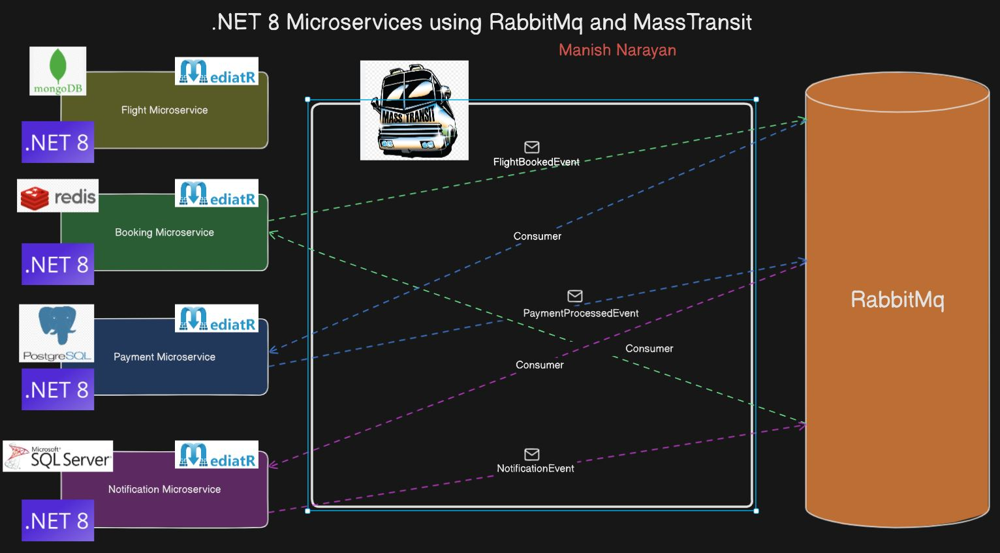

# Airline Booking System

## Setup

1. Connect to any MSSQL Server instance and run [initial script](source/InitialDataSchema/SchemaAndData.sql).

2. Specify your MSSQL Server in the Notifications API connection string.

3. Go to the **/docker** directory and start the remaining services.

    ```bash
    docker-compose up
    ```

## Architecture Diagram


